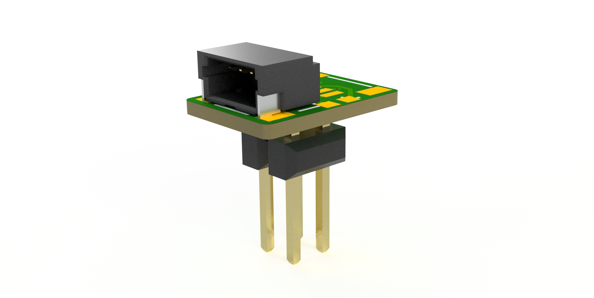

# Arduino Giga R1 Qwiic Adapter

A small adapter for adding a I2C Qwiic / Stemma QT connector (footprint for both right angle and vertical) to the front 2x10 pin connector of the Arduino Giga R1.

BOM:

SMT 2x2 header: Molex 15-91-0040 or equivalent

Qwiic: JST-SH 4 pin or Amphenol 10116782-004010LF

2x 0603 resistors depending on your needs. 2.2k-10kohm is typical.

